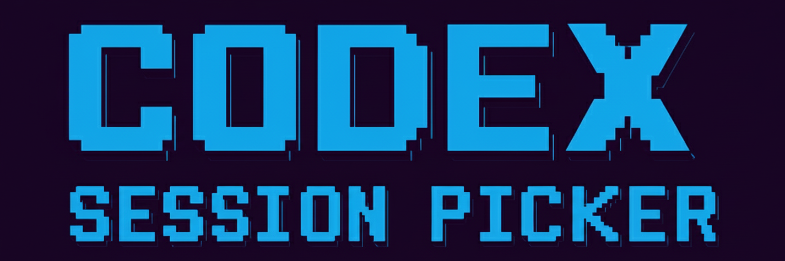
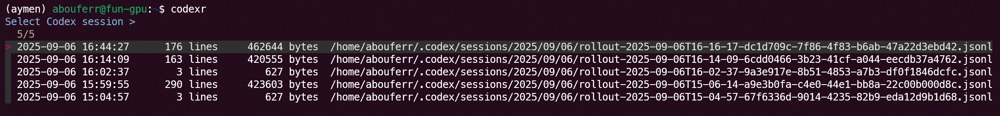

<p align="center">
  
</p>

<p align="center">
  <strong>Codex Session Picker</strong> · Interactive CLI to find & resume OpenAI Codex sessions fast.
</p>

<p align="center">
  <a href="#installation">Install</a> ·
  <a href="#usage">Usage</a> ·
  <a href="#troubleshooting">Troubleshooting</a> ·
  <a href="#license">License</a>
</p>

---

## Overview

`codexr` is a tiny helper that scans `~/.codex/sessions` and presents an
interactive list (via <a href="https://github.com/junegunn/fzf">fzf</a>)
showing **timestamp**, **line count**, **size**, and the **full path** of each `.jsonl`
session. Choose with the arrow keys and hit **Enter**—we'll invoke:

```bash
codex -c experimental_resume="/full/path/to/rollout-....jsonl"
```

If `fzf` isn't installed, `codexr` falls back to a non‑interactive mode where you can
resume the **N-th newest** session (default: newest).

---

## Demo

<p align="center">
  <!-- Replace this with a real screenshot of your terminal -->
  
</p>

---

## Requirements

- Bash (>= 4)
- GNU `find`, `awk`, `wc`, `date`
- OpenAI Codex CLI installed & configured
- Optional (recommended): <a href="https://github.com/junegunn/fzf">fzf</a>

Install `fzf` on Debian/Ubuntu:
```bash
sudo apt update && sudo apt install -y fzf
```

---

## Installation

```bash
git clone https://github.com/<your-username>/codex-session-picker.git
cd codex-session-picker
chmod +x install.sh
./install.sh
# Then reload your shell
source ~/.bashrc   # or: source ~/.zshrc
```

This adds the `codexr` function to your shell profile.

---

## Usage

Interactive picker (fzf):
```bash
codexr
```

Fallback (no fzf): resume the N‑th newest session (1 = newest):
```bash
codexr 2   # resume the 2nd newest
codexr 5   # resume the 5th newest
```

---

## Troubleshooting

**No sessions found**  
Ensure files exist under `~/.codex/sessions/**/rollout-*.jsonl`.

**`date -d` not supported**  
The script uses GNU `date`. On macOS, install coreutils (`brew install coreutils`).

**Change preview content**  
Edit `codexr.sh` and modify the `--preview` command (e.g. `tail -n 60` → `head -n 50`).

---

## Development

- `codexr.sh`: main function & listing logic
- `install.sh`: appends a small source block to your shell rc file
- `assets/banner.png`: repository banner
- `docs/demo.png`: replace with a screenshot of your terminal

---

## License

[MIT](./LICENSE)
